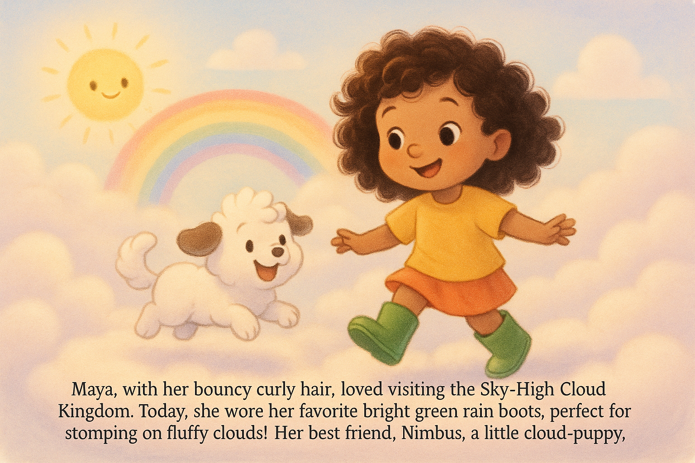
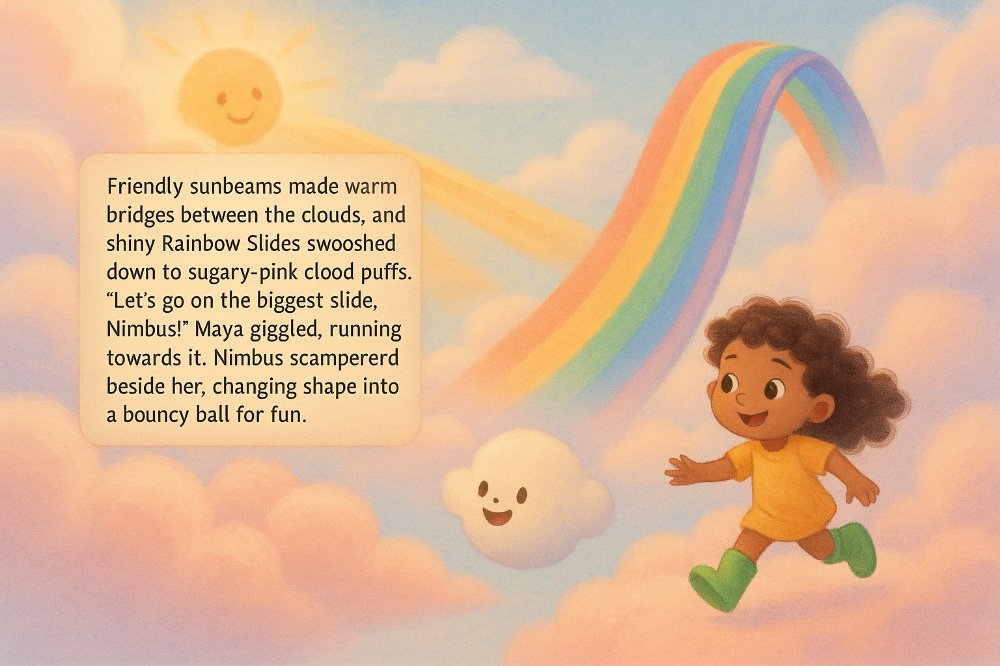
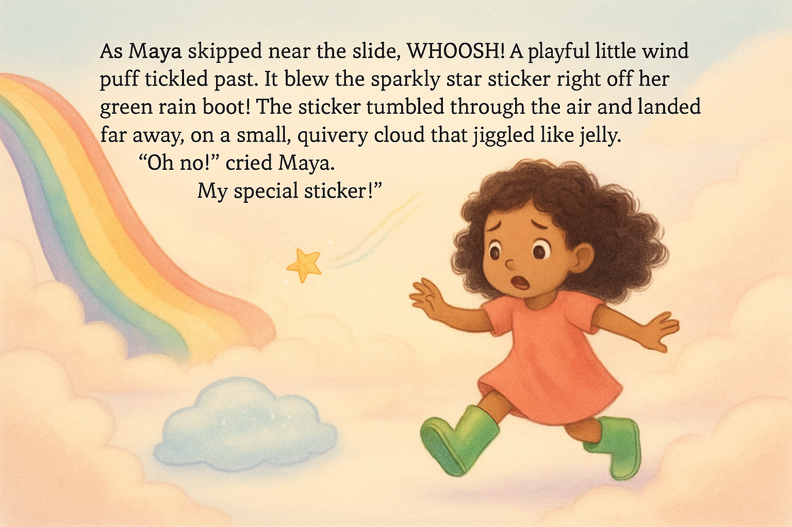
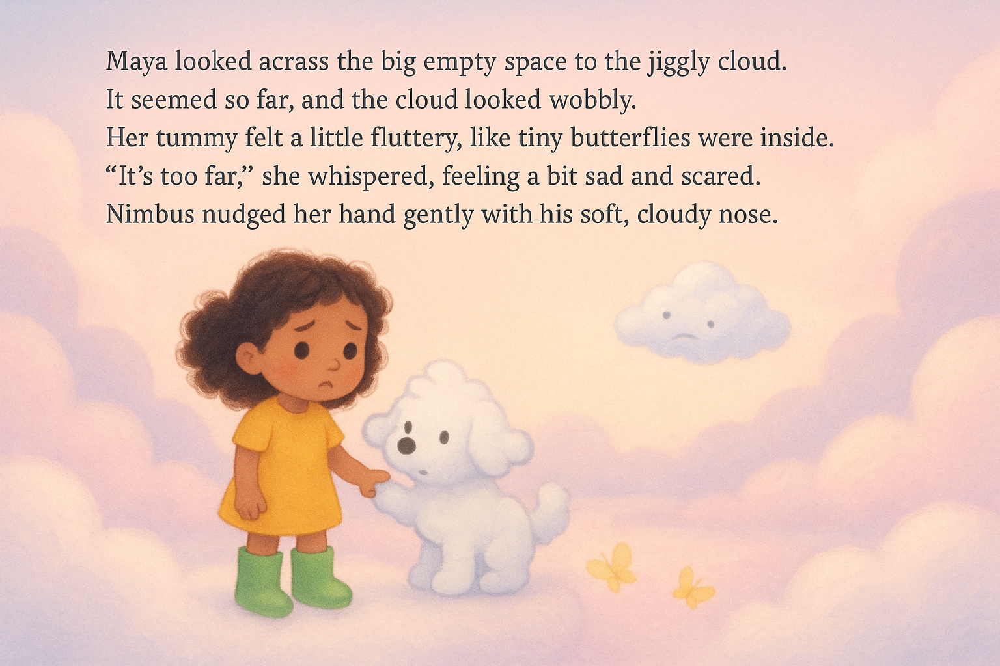
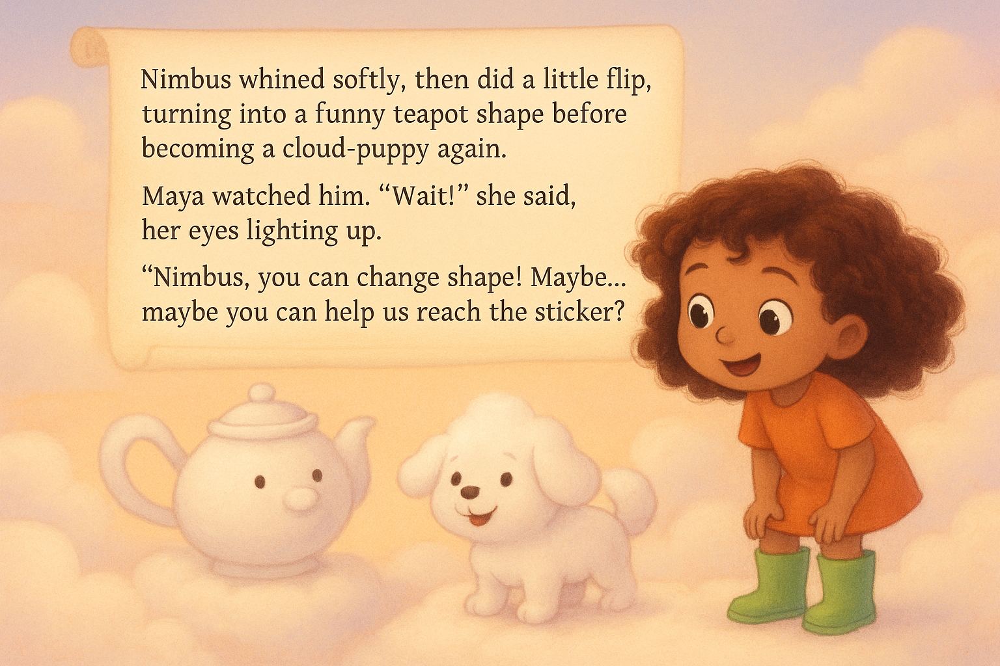
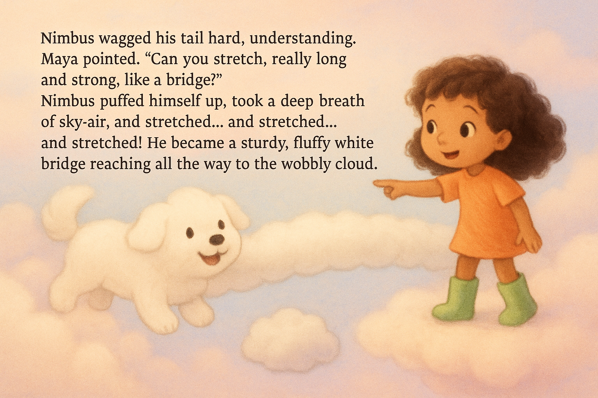
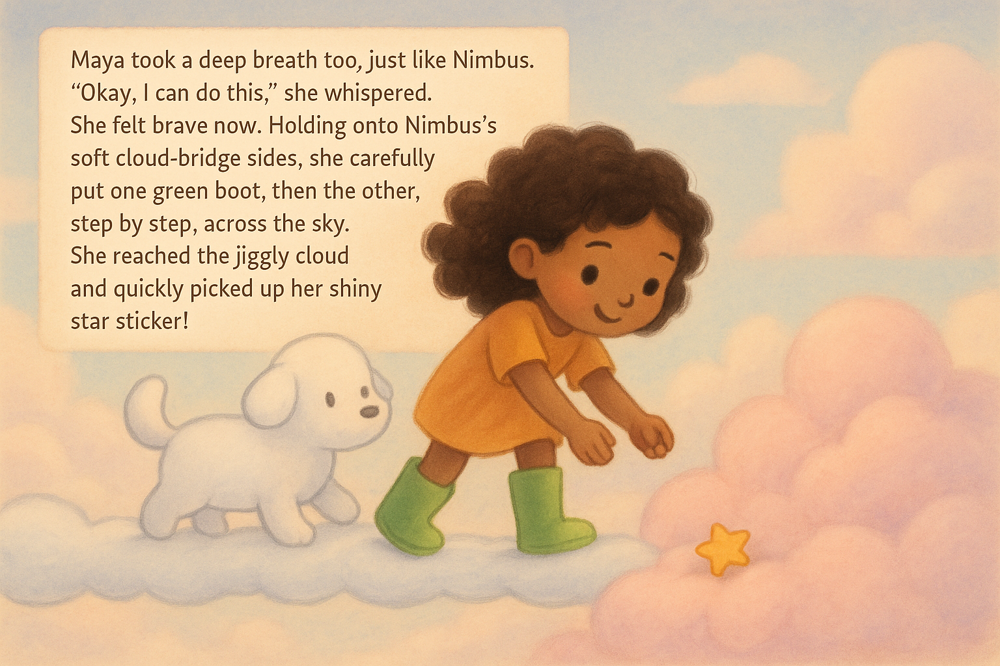
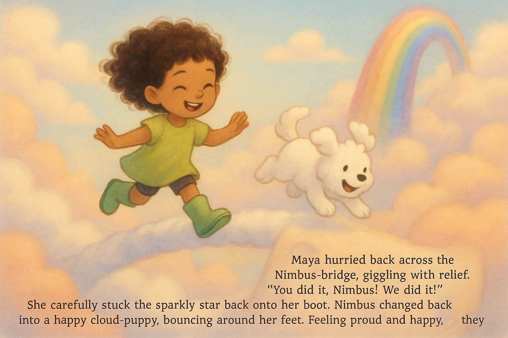

# Story Book Creator

An AI-powered tool that creates personalized children's storybooks with text and illustrations.

## Overview

Story Book Creator uses generative AI to craft engaging children's stories with matching illustrations. By providing simple configuration details, you can generate complete storybooks featuring custom characters, themes, and settings.

Features:
- Create original stories using AI, tailored to specific age ranges
- Generate matching illustrations for each page
- Include your own characters with custom images
- Configure story themes, settings, and length
- Automatic book organization with pages and metadata

## Installation

### Prerequisites
- Python 3.12 or higher
- OpenAI API key
- Google Gemini API key

### Setup

1. Clone the repository:
   ```bash
   git clone https://github.com/yourusername/story-book-creator.git
   cd story-book-creator
   ```

2. Install dependencies:
   ```bash
   uv sync
   ```

3. Create a `.env` file in the project root with your API keys:
    ```bash
    cp .env.example .env
    ```
    ```bash
    OPENAI_API_KEY=your_openai_key_here
    GEMINI_API_KEY=your_gemini_key_here
    ```

## Usage

1. Create your story configuration by copying the example:
   ```bash
   cp story_config.example.json input/story_config.json
   ```

2. Edit `input/story_config.json` to customize your story:
   ```json
   {
     "characters": [
       {
         "name": "Ella",
         "description": "A baby human with a big smile",
         "image_path": "input/images/ella.jpeg"
       },
       {
         "name": "Rory",
         "description": "A black and white tibetan terrier puppy"
       }
     ],
     "theme": "Friendship and overcoming fears",
     "age_range": "1-2 years",
     "location": {
       "setting": "A sunny meadow next to a sparkling blue river",
       "details": ["Tall swaying grass", "Colorful wildflowers", "Busy buzzing bees"]
     },
     "story_length_pages": 5,
     "image_style": "Colorful cartoon illustration, simple and friendly, watercolor texture"
   }
   ```

3. Run the story creator:
   ```bash
   uv run main.py
   ```

4. Find your generated storybook in the `output` directory. Each story is saved in its own timestamped folder.

## Configuration Options

### Characters
- `name`: The character's name (required)
- `description`: Physical and personality details (required)
- `image_path`: Optional path to a character image to incorporate into illustrations

### Story Settings
- `theme`: Main story theme or message
- `age_range`: Target audience age
- `location`: Setting details including specific features
- `story_length_pages`: Number of pages (4-20)
- `image_style`: Description of the desired illustration style

## Including Character Images

To incorporate your own characters into the illustrations:

1. Add character images to the `input/images/` directory
2. Reference these images in your configuration with the `image_path` property
3. The system will intelligently incorporate the characters into each story page where they appear

## Output

Each generated story includes:

- A full story text file
- Individual illustrated page images
- A JSON manifest with page details
- The original configuration used to generate the story

## Examples

The repository includes several pre-generated examples to help you understand what Story Book Creator can produce:

- **Example 1**: A story about Maya and Nimbus in the Sky-High Cloud Kingdom
- **Example 2**: An adventure in Sparkle Bay
- **Example 3**: Ella's adventure in a sunny garden

<details>
<summary>📖 View Example 1: Maya's Adventure</summary>

### Story Configuration

```json
{
    "characters": [
      {
        "name": "Maya",
        "description": "An adventurous 5-year-old girl with curly hair and bright green rain boots"
      },
      {
        "name": "Nimbus",
        "description": "A fluffy white cloud-puppy that can shape-shift into funny objects"
      }
    ],
    "theme": "Courage and creative problem-solving",
    "age_range": "4-6 years",
    "location": {
      "setting": "The Sky-High Cloud Kingdom",
      "details": ["Cotton-candy clouds", "Rainbow slides", "Friendly sunbeam bridges"]
    },
    "story_length_pages": 8,
    "image_style": "Soft pastel cartoon, gentle gradients, dreamy story-book feel"
}
```

### Generated Story

> Maya, with her bouncy curly hair, loved visiting the Sky-High Cloud Kingdom. Today, she wore her favorite bright green rain boots, perfect for stomping on fluffy clouds! Her best friend, Nimbus, a little cloud-puppy, barked happily, wagging his misty tail. They bounced together on clouds that felt like soft cotton candy.
>
> Friendly sunbeams made warm bridges between the clouds, and shiny Rainbow Slides swooshed down to sugary-pink cloud puffs. "Let's go on the biggest slide, Nimbus!" Maya giggled, running towards it. Nimbus scampered beside her, changing shape into a bouncy ball for fun.
>
> As Maya skipped near the slide, WHOOSH! A playful little wind puff tickled past. It blew the sparkly star sticker right off her green rain boot! The sticker tumbled through the air and landed far away, on a small, quivery cloud that jiggled like jelly. "Oh no!" cried Maya. "My special sticker!"
>
> Maya looked across the big empty space to the jiggly cloud. It seemed so far, and the cloud looked wobbly. Her tummy felt a little fluttery, like tiny butterflies were inside. "It's too far," she whispered, feeling a bit sad and scared. Nimbus nudged her hand gently with his soft, cloudy nose.
>
> Nimbus whined softly, then did a little flip, turning into a funny teapot shape before becoming a cloud-puppy again. Maya watched him. "Wait!" she said, her eyes lighting up. "Nimbus, you can change shape! Maybe... maybe you can help us reach the sticker?"
>
> Nimbus wagged his tail hard, understanding. Maya pointed. "Can you stretch, really long and strong, like a bridge?" Nimbus puffed himself up, took a deep breath of sky-air, and stretched… and stretched… and stretched! He became a sturdy, fluffy white bridge reaching all the way to the wobbly cloud.
>
> Maya took a deep breath too, just like Nimbus. "Okay, I can do this," she whispered. She felt brave now. Holding onto Nimbus's soft cloud-bridge sides, she carefully put one green boot, then the other, step by step, across the sky. She reached the jiggly cloud and quickly picked up her shiny star sticker!
>
> Maya hurried back across the Nimbus-bridge, giggling with relief. "You did it, Nimbus! We did it!" She carefully stuck the sparkly star back onto her boot. Nimbus changed back into a happy cloud-puppy, bouncing around her feet. Feeling proud and happy, they raced together to the top of the Rainbow Slide and zoomed down with happy shouts.

### Pictures










</details>

## Notes

- Story generation can take several minutes depending on length
- Higher quality illustrations require more processing time
- Both API keys must be valid for the system to work

## Contributing

Contributions are welcome! Please feel free to submit a Pull Request.